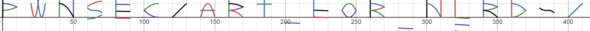

# Deezmos PWNSEC CTF 2024 Write-up
## The problem
We are given a python file `deezmos.py` that seems to generate the `out.txt` file. 
The `deezmos.py` file takes in 2 unknown inputs: The flag and a list of functions that convert letters to a bunch of functions.

For each letter in the flag, letters_to_func gives us certain functions. Then for each function we create a shifted function based on the letters' position in the array. 

So in short every letter is associated with some characteristic functions stored in letters_to_func. Then we shift all of these functions based on the position of the letter in the flag and we write the output of some fixed x axis values to the out.txt file.

These fixed points were decided by `x = np.linspace(-100, 100, 5)`. The corresponding y values were found by passing them to the functions and these points were stored in the out.txt file.

## The solution
**We have to find the original functions!**

For each set of points I used numpy.polyfit to fit a polynomial to the function. I added each reconstructed function to its corresponsing letter in a
After obtaining the polynomials, my original solution was to input each function one by one into desmo. I noticed that each letter ocuppies 10 units on the x axis and there is a space of 10 units between each letter. So i refinied my output to contain x axis limits. I then paster the output of the file into desmos to obtain the following result.

Finally the flag is PWNSEC{ART_FOR_NERDS}

Last S is messed up for some reason I did not investigate.

## Remarks
This was my first CTF in a while and my very first write up for one as well and, the little time I spent on it i enjoyed immensely. I secured the first blood for this question and failed to solve any more. But now my rustiness has improved look forward for more to come.
